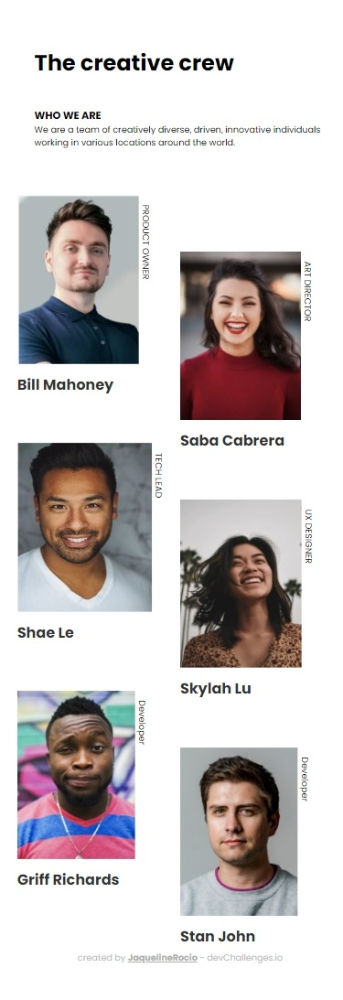
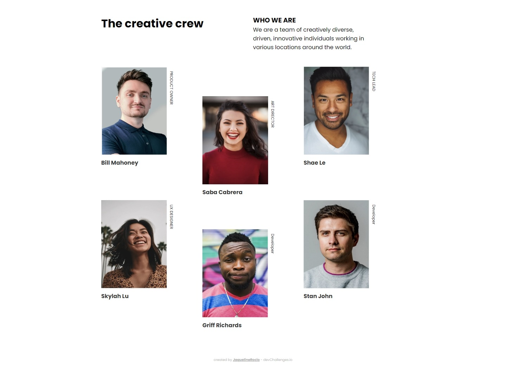

# My Team Page - Make It Real

This is a solution to the "My Team Page" project from the **Make It Real** course.

## Table of contents

- [Overview](#overview)
  - [The challenge](#the-challenge)
  - [Screenshot](#screenshot)
- [My process](#my-process)
  - [Built with](#built-with)
  - [What I learned](#what-i-learned)
  - [Continued development](#continued-development)
  - [Useful resources](#useful-resources)
- [Author](#author)

## Overview

### The challenge

Users should be able to:

- See the team structure with images and descriptions.
- Navigate a responsive page that adapts to different screen sizes.
- View the page on both mobile and desktop devices with a fluid layout.

### Screenshot




## My process

### Built with

- Semantic HTML5 markup
- CSS custom properties
- Flexbox for page layout
- Grid for team structure layout
- Mobile-first workflow

### What I learned

This project allowed me to strengthen my knowledge in **CSS Grid** and **Flexbox** to create responsive layouts. Here is a code snippet I'm proud of:

```css
.team-member {
  display: grid;
  grid-template-columns: repeat(6, 1fr);
  grid-template-rows: repeat(5, 1fr);
}
```

If you want more help with writing markdown, we'd recommend checking out [The Markdown Guide](https://www.markdownguide.org/) to learn more.

This code helped me organize the team members in a clear and adaptable structure for different screen sizes.

## Continued development

In future projects, I would like to continue improving my skills in creating more complex layouts using CSS Grid and Flexbox. I also plan to dive deeper into advanced CSS techniques like animations and transitions to enhance the user experience.

## Useful resources

- **[MDN Web Docs](https://developer.mozilla.org/)** - This resource helped me better understand how Flexbox and Grid work, and I will continue to use it in future projects.

## Author

- GitHub - [JaquelineRocio](https://github.com/JaquelineRocio)
